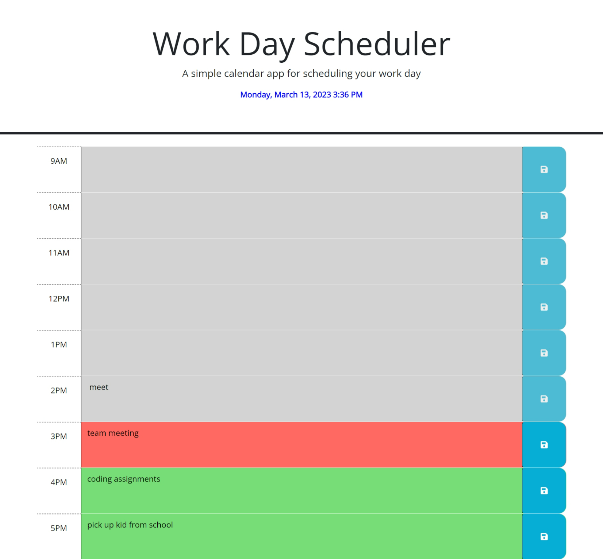

# Work Day Scheduler

## Description

This is a simple calendar application that allows you to save events for each hour of the day during standard business hours.

## Usage

The current day is displayed on the top of the calendar. The page contains time blocks for each hour of the day color coded with gray, orange and green colors to indicate whether it is in the past, present, or future respectively. When you click into a time block you can enter an event and then when you click save button for that time block the text entered is saved in local storage and you can see the events persisting even after refreshing the page.      
    

## Credits

Built this application based on the knowledge gathered from bootcamp activities.
Used JQuery and dayjs libraries to build this application.

## License

MIT License

## Project URL

URL link to the Work Day Scheduler webpage:
(https://saritha2708.github.io/workday-scheduler/).

## Project image

The following image shows the display of the webpage:

